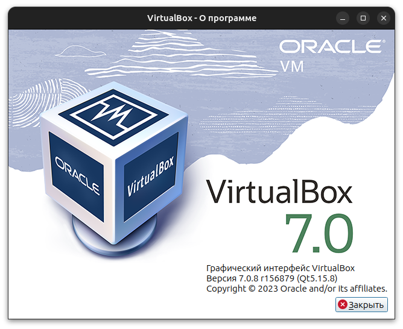
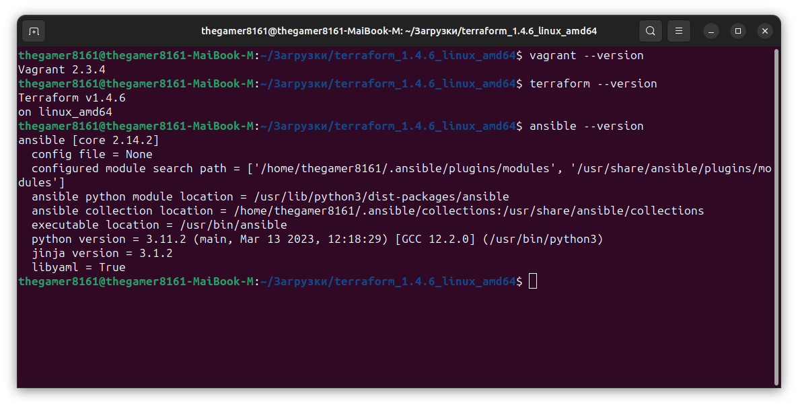
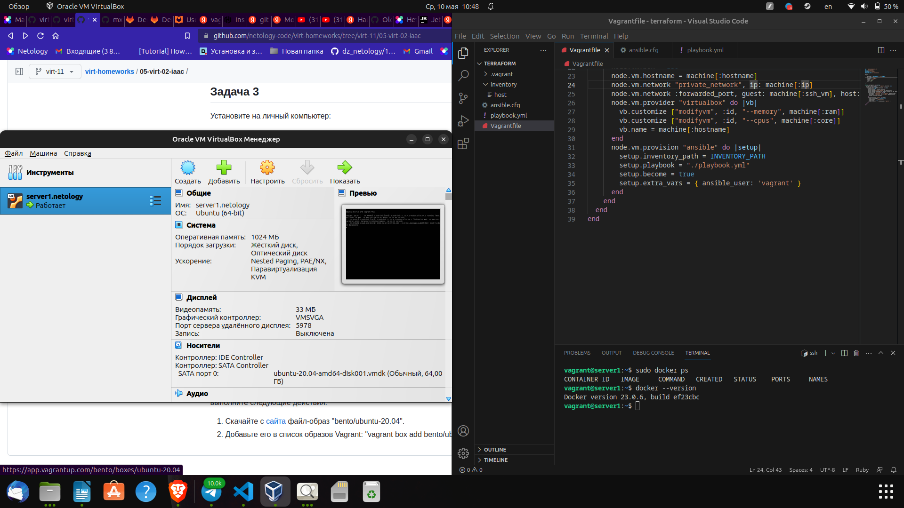

# Домашнее задание к занятию 2. «Применение принципов IaaC в работе с виртуальными машинами»
# Никоноров Денис - FOPS-6

## Задача 1
*Опишите основные преимущества применения на практике IaaC-паттернов.*
*Какой из принципов IaaC является основополагающим?*

Основными преимуществами применения на практике IaaC-паттернов являются:

1. Автоматизация: IaaC-паттерны позволяют автоматически создавать, настраивать и управлять инфраструктурой с использованием программных средств. Это позволяет значительно сократить время, затрачиваемое на настройку и управление инфраструктурой.

2. Повторяемость: IaaC-паттерны гарантируют повторяемость создания инфраструктуры. Это означает, что при внесении изменений в шаблоны кода, эти изменения будут автоматически отображаться в любом последующем запуске инфраструктуры.

3. Масштабируемость: IaaC-паттерны позволяют быстро масштабировать инфраструктуру на основе потребностей бизнеса. Это значительно упрощает возможность обеспечения роста бизнеса, даже в условиях быстрого роста.

4. Безопасность: IaaC-паттерны способствуют повышению безопасности инфраструктуры за счет стандартизации и автоматизации процессов.

5. Управляемость: IaaC-паттерны позволяют управлять всей инфраструктурой как единым целым, что значительно упрощает ее управление и снижает риски возникновения проблем.

Основополагающим принципом IaaC является декларативный подход, который подразумевает описание желаемого состояния инфраструктуры в виде кода или конфигурации, без указания шагов для ее создания и настройки. Это позволяет автоматизировать процесс создания и управления инфраструктурой, а также снизить вероятность ошибок, связанных с ручным вмешательством в процесс.

## Задача 2
*Чем Ansible выгодно отличается от других систем управление конфигурациями?*
*Какой, на ваш взгляд, метод работы систем конфигурации более надёжный — push или pull?*

Ansible выгодно отличается от других систем управления конфигурациями следующими особенностями:

1. Простота использования: Ansible имеет простой, понятный и дружественный к пользователю интерфейс, что делает его использование более легким для новичков и профессионалов.

2. Автоматизация: Ansible позволяет автоматически настраивать, управлять и автоматизировать инфраструктуру.

3. Возможности масштабирования: Ansible позволяет легко масштабировать инфраструктуру на основе потребностей бизнеса.

4. Поддержка большого количества устройств и операционных систем: Ansible базируется на YAML и Python, что позволяет работать со многими ОС и устройствами.

5. Push-ориентированный метод работы: Ansible использует push-ориентированный метод работы, что означает, что конфигурация пересылается на целевой хост из центрального контроллера.

На мой взгляд, метод работы системы конфигурации зависит от конкретных потребностей и требований к системе. Push-ориентированный метод работы, как в Ansible, обеспечивает более быструю и точную доставку настроек, что может быть полезно в крупных коммерческих средах, где необходимо обеспечивать синхронизацию конфигурации множества хостов. С другой стороны, pull-ориентированный метод работы, как в Puppet, позволяет хранить множество конфигурационных файлов в центральном репозитории, что упрощает управление и обновление настроек, а также увеличивает устойчивость системы. В любом случае, выбор метода работы должен зависеть от требований к инфраструктуре и ее характеристик.

## Задача 3
*Установите на личный компьютер:*

* VirtualBox,
* Vagrant,
* Terraform,
* Ansible.
Приложите вывод команд установленных версий каждой из программ, оформленный в Markdown.





## Задача 4

Воспроизведите практическую часть лекции самостоятельно.

Создайте виртуальную машину.
Зайдите внутрь ВМ, убедитесь, что Docker установлен с помощью команды
```
docker ps
```

